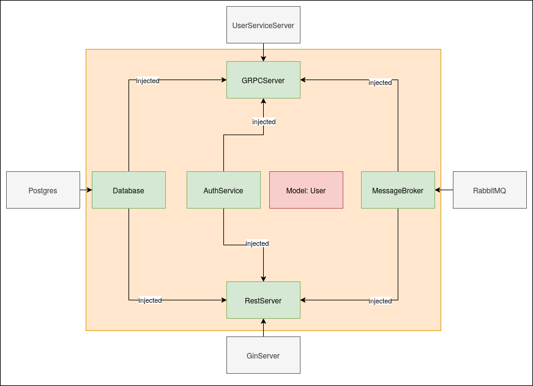

# User Service

This is a User Service built with Go, Gin, PostgreSQL, and RabbitMQ. It provides RESTful APIs to manage users, including creating, updating, and deleting users. The service also publishes user creation messages to RabbitMQ.

## Prerequisites

- Go 1.22+
- Docker
- Docker Compose

## Architecture

This service provides a rest and a grpc endpoint by standard. As the user-service is just a Rest/GRPC Interface Layer for the DB with no internal logic, all functionality is provided in the Endpoint Implementation itself, without relying on some form of central service layer.

## Getting Started

### Running with Docker Compose

To run the service with Docker Compose pull the , use the following command:

```sh
docker-compose up 
```
This will start the PostgreSQL, RabbitMQ, and User Service containers.

## Running Locally
To run the service locally, set the following environment variables and run the application:

```sh
export GIN_MODE: debug
export DB_HOST=localhost
export DB_PORT=5432
export DB_USER=postgres
export DB_PASSWORD=password
export DB_NAME=recipe
export RABBITMQ_HOST=localhost
export RABBITMQ_PORT=5672
export RABBITMQ_USER=guest
export RABBITMQ_PASSWORD=guest
export FLUENTD_HOST=localhost
export FLUENTD_PORT=9880

go run main.go
```
## REST API
### Create User
URL: /users
Method: POST
Request Body:
 ```json
{
  "username": "johndoe",
  "firstname": "John",
  "lastname": "Doe"
}
```

### Update User
URL: /users
Method: PUT
Request Body:

```json
{
  "username": "johndoe",
  "firstname": "John",
  "lastname": "Doe"
}
```
### Delete User
URL: /users/:username
Method: DELETE
Success Response:
* Code: 200 OK

### Get User
URL: /users/:username
Method: GET
Success Response:
* Code: 200 OK

### Login
URL /api/v1/auth

Method: POST

Request Body:
 ```xml
 <RequestHeader>
 Authorization: username:password
 </RequestHeader>
```

Returns: 
```json
{
 "jwt": "<jwt>"
}
```

### Auth
URL /api/v1/auth

Method: Get

Request Body:
 ```xml
 <RequestHeader>
 Authorization: jwt-token
 </RequestHeader>
```

## GRPC

gRPC Interface
The User Service also provides a gRPC interface with the following methods:

```go
syntax = "proto3";

package user;
option go_package = "proto/user";
service UserService {
  rpc ListUsers (Empty) returns (UserListResponse);
  rpc GetUser (GetUserRequest) returns (UserResponse);
  rpc CreateUser (User) returns (UserResponse);
  rpc UpdateUser (User) returns (UserResponse);
  rpc DeleteUser (DeleteUserRequest) returns (DeleteUserResponse);
  rpc Auth (AuthRequest) returns (AuthResponse);
}


message Empty {}

message User {
  string username = 1;
  string firstname = 2;
  string lastname = 3;
}

message GetUserRequest {
  string username = 1;
}

message UserResponse {
  User user = 1;
}

message UserListResponse {
  repeated User users = 1;
}

message DeleteUserRequest {
  string username = 1;
}

message DeleteUserResponse {
  string message = 1;
}

message AuthRequest {
  string token = 1;
}

message AuthResponse {
  string message = 1;
}
```

## MessageBroker
The User Service uses RabbitMQ as a message broker to publish user creation messages. A simple interface is provided to allow for similar tools. The RabbitMQ struct in the messagebroker.go file handles the connection, publishing, and subscribing to RabbitMQ.

### Connect
The Connect method establishes a connection to the RabbitMQ server using the provided credentials and host information.

### Disconnect
The Disconnect method closes the connection to the RabbitMQ server.

### Publish
The Publish method publishes a message to the specified exchange with the given routing key and message body.

### Subscribe
The Subscribe method subscribes to messages from the specified exchange and routing key, and processes them using the provided handler function.

